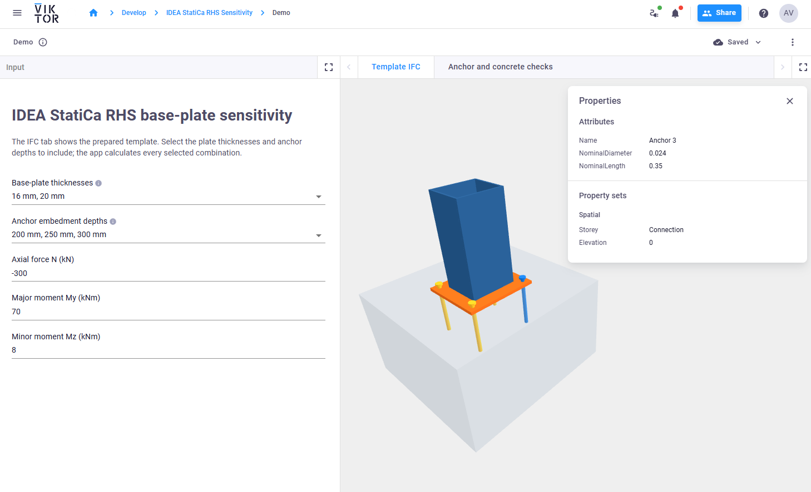
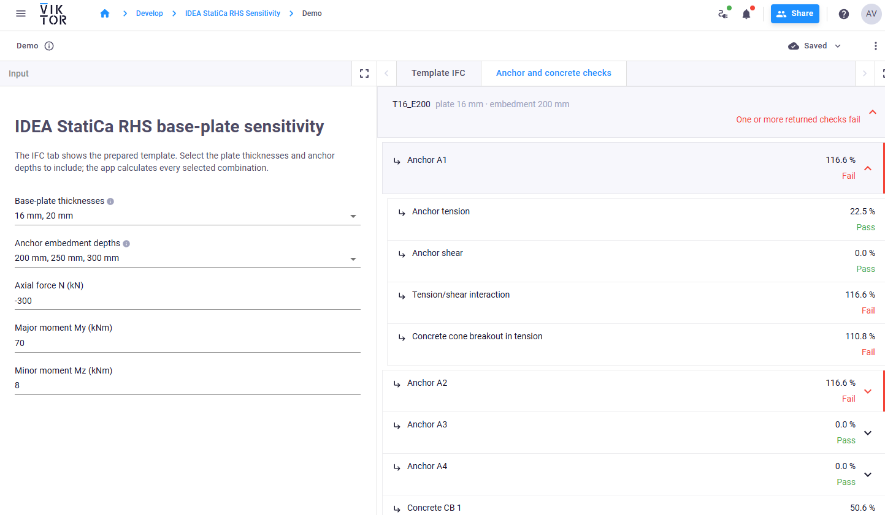
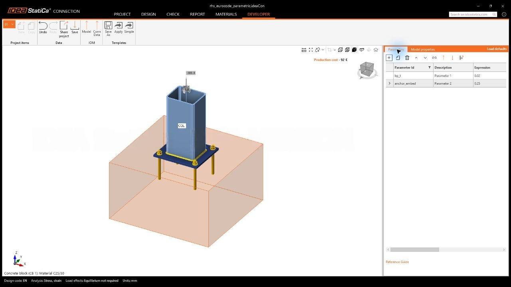
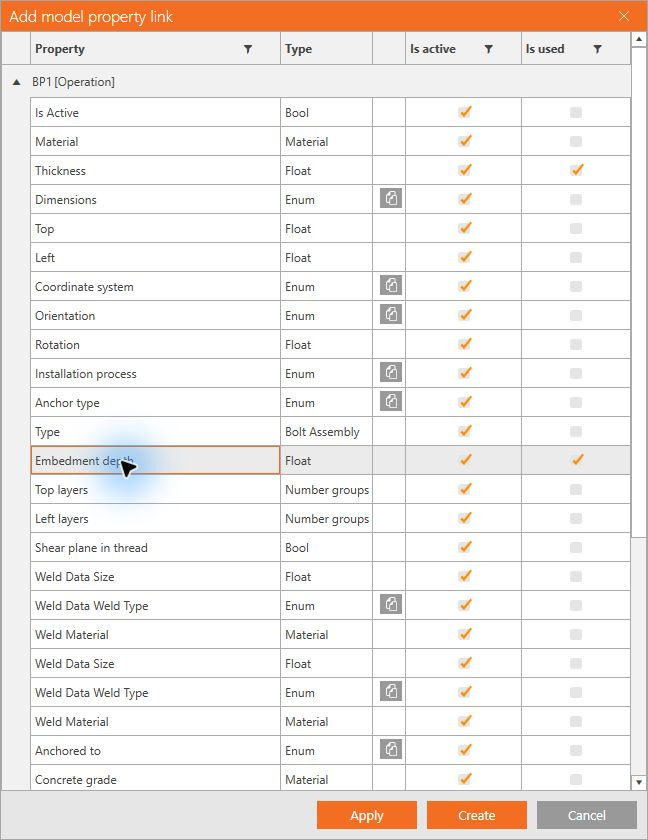
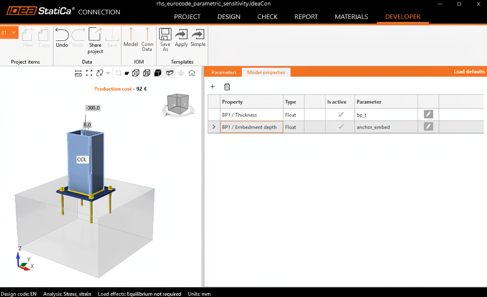
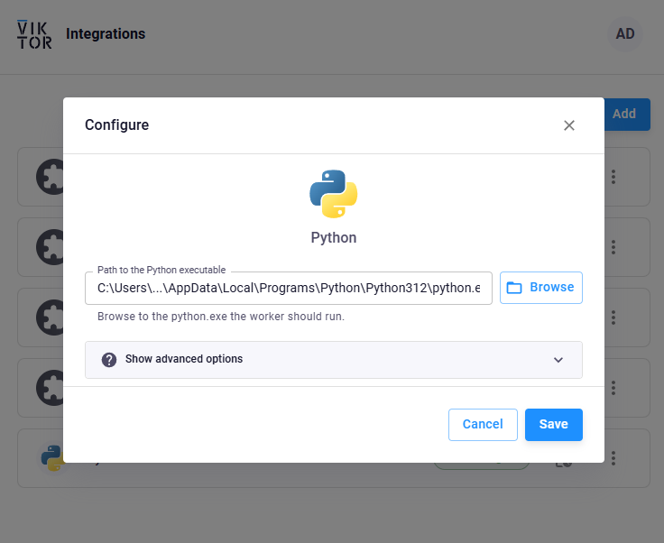

# IDEA StatiCa RHS base-plate sensitivity

Sample app that integrates VIKTOR with IDEA StatiCa Connection. It analyses an RHS base plate from a reusable [IDEA StatiCa template](app/templates/rhs_eurocode_parametric_sensitivity.ideaCon), sweeps multiple Developer parameters, and returns a detailed check hierarchy for every combination.

The current example sweeps base-plate thickness (`bp_t`) and anchor embedment (`anchor_embed`), while applying the entered axial force `N` and moments `My` and `Mz` to every case. It also displays the model as an IFC file in VIKTOR's **Template IFC** view.





## What the app does

1. The user selects one or more plate thicknesses and anchor embedment depths.
2. VIKTOR sends every thickness/depth combination and the entered loads to a local Python worker.
3. The worker copies the `.ideaCon` template, updates its Developer parameters, runs the IDEA StatiCa CBFEM calculation, and reads the results.
4. The VIKTOR Data view shows every iteration, including anchor, concrete, and steel checks. `Anchor A1` can expand to its active verification modes, such as tension, shear, tension/shear interaction, and concrete cone breakout.

The worker never alters the source template; each calculation uses its own job copy.

## Create the IDEA StatiCa Connection template

Start with an RHS/base-plate connection that calculates successfully in IDEA StatiCa Connection. Enable **Developer mode** and create two parameters using SI lengths in metres:

| Parameter | Purpose | Baseline expression |
| --- | --- | ---: |
| `bp_t` | Base-plate thickness | `0.020` |
| `anchor_embed` | Anchor embedment depth | `0.250` |

`1 + 1` is only IDEA StatiCa's placeholder expression; replace it with the baseline engineering value before linking it.



In **Developer → Model properties**, add a link from `BP1 → Thickness` to `bp_t`, and a link from `BP1 → Embedment depth` to `anchor_embed`.



Verify that both parameter names appear in the **Parameter** column. Then use **Developer → Save As** to save the reusable Connection template.



Open that `.contemp` template in IDEA StatiCa and save a project copy as `.ideaCon`. Store both the project and its matching IFC in the template folder:

```text
app/templates/rhs_eurocode_parametric_sensitivity.ideaCon
app/templates/rhs_eurocode_parametric_sensitivity.ifc
```

The public REST API can update existing Developer parameters, but it cannot create those Developer links or author individual plates, bolts, and welds. See the [IDEA StatiCa Connection API concepts](https://developer.ideastatica.com/docs/api/connection-api/connection_api_concepts.html).

## Configure VIKTOR Desktop and the Python worker

Install and sign in to [VIKTOR Desktop](https://docs.viktor.ai/docs/create-apps/software-integrations/viktor-desktop/), then add a **Python** worker. In its configuration, select the path to the **Python executable**, not a Python script.



Use `where python` in PowerShell to list the available Python executables, then select the intended one in VIKTOR Desktop. `app/run_idea_statica.py` is submitted by the VIKTOR app automatically, so do not select that script in VIKTOR Desktop. Install the worker requirements in the same Python environment selected for the worker:

```powershell
where python
python -m pip install -r worker-requirements.txt
```

VIKTOR Desktop starts, stops, and shows logs for the worker. IDEA StatiCa and its license must be installed on the same Windows machine as the worker. See the [official VIKTOR Desktop guide](https://docs.viktor.ai/docs/create-apps/software-integrations/viktor-desktop/).

## Install and run the app

Install and configure the VIKTOR CLI. If the VIKTOR platform app has not yet been created, register it once with the same name as `viktor.config.toml`:

```powershell
viktor-cli create-app "idea-statica-rhs-sensitivity"
```

From this repository, perform the first clean local installation and launch:

```powershell
viktor-cli clean-start
```

For later sessions, use:

```powershell
viktor-cli start
viktor-cli test
```

Do not run `create-app` again for an already registered app.

## IDEA StatiCa version and REST port

The worker deliberately has the IDEA StatiCa install path and API URL visible near the start of [app/run_idea_statica.py](app/run_idea_statica.py):

```python
idea_install = Path(r"C:\Program Files\IDEA StatiCa\StatiCa 26.0")
idea_api_url = "http://127.0.0.1:5193"
```

When upgrading IDEA StatiCa, update `idea_install` to the installed folder and install a matching `ideastatica-connection-api` version in the worker environment. If port `5193` is occupied, change both `idea_api_url` and the `-port:5193` service argument in the same file to an unused port. The Connection API service runs locally and can be started on a chosen port. [IDEA StatiCa's API setup guide](https://developer.ideastatica.com/docs/api/connection-api/connection_api_getting_started.html) documents the version match and manual service configuration.

## References

- [IDEA StatiCa Connection API: getting started](https://developer.ideastatica.com/docs/api/connection-api/connection_api_getting_started.html)
- [IDEA StatiCa Connection API: concepts, templates, parameters, and results](https://developer.ideastatica.com/docs/api/connection-api/connection_api_concepts.html)
- [VIKTOR Desktop](https://docs.viktor.ai/docs/create-apps/software-integrations/viktor-desktop/)
- [VIKTOR CLI reference](https://docs.viktor.ai/docs/create-apps/references/cli/)
